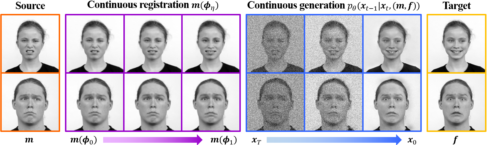

## My attempt to use DiffuseMorph
I've tried to reproduce the results of this article for the RaFD dataset, but it seems impossible. I'm not the only one, as you can see from the issues in the repository (https://github.com/DiffuseMorph/DiffuseMorph/issues), all of which have gone unanswered. The authors don't answer my questions sent by email either.

The code provided was only prepared for a pair of images (toy_sample), so I had to make some modifications to train the entire RaFD dataset, which I previously cropped up and resized according to the article's guidelines.

- RAFD_dataset.py adapted to get the images from the subfolders. Each subfolder corresponds to a subject. The (modified,fixed) image pairs are made through combinations without repetition: C(24,2) = 24!/(2!x(24-2)! =276
- Crop images to 640x640.
- Resize images to 128x128.

In addition, I also had to adapt the code to be able to use batch sizes greater than 2 and thus run tests with different batch sizes.

Example of an attempt to train the model using batch size = 2 and num of workers = 16:


Modifications:
- Class RAFDDataset modified to obtain image pairs
- Schedule error fixed
- Modifications to run with batch size > 2 (branch-> batchsize)

//------------------------------------------------------------------------------------------------------------------------------------------------------------------------------------------//

 The following README section is from the original repository -> https://github.com/DiffuseMorph/


# DiffuseMorph

This repository is the official implementation of "DiffuseMorph: Unsupervised Deformable Image Registration Using Diffusion Model" which is presented at ECCV 2022.

[[ECCV paper](https://link.springer.com/chapter/10.1007/978-3-031-19821-2_20)]

## Requirements
  * OS : Ubuntu
  * Python >= 3.6
  * PyTorch >= 1.4.0

## Data
In our experiments, we used the following datasets:
* 2D facial expression images: [RaFD dataset](https://rafd.socsci.ru.nl/RaFD2/RaFD?p=main)
* 3D cardiac MR images: [ACDC dataset](https://acdc.creatis.insa-lyon.fr/description/databases.html)
* 3D brain MR images: [OASIS-3 dataset](https://www.oasis-brains.org/)

## Training

To train our model for 2D image registration, run this command:

```train
python3 main_2D.py -p train -c config/diffuseMorph_train_2D.json
```
To train our model for 3D image registration, run this command:

```train
python3 main_3D.py -p train -c config/diffuseMorph_train_3D.json
```

## Test

To test the trained our model for 2D image registration, run:

```eval
python3 main_2D.py -p test -c config/diffuseMorph_test_2D.json
```

To test the trained our model for 3D image registration, run:

```eval
python3 main_3D.py -p test -c config/diffuseMorph_test_3D.json
```

## Citation

```    
@inproceedings{kim2022diffusemorph,
  title={DiffuseMorph: Unsupervised Deformable Image Registration Using Diffusion Model},
  author={Kim, Boah and Han, Inhwa and Ye, Jong Chul},
  booktitle={European Conference on Computer Vision},
  pages={347--364},
  year={2022},
  organization={Springer}
}
```
